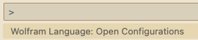
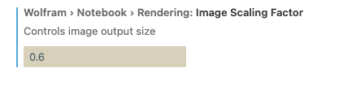
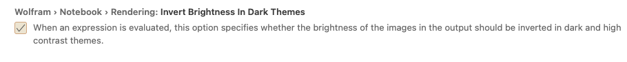

# Configuration Details

## Kernel management

If you have the Wolfram System (either Wolfram, Mathematica, or Wolfram Engine) installed in the default location on your system, you may not have to change any kernel settings. 

By default, the extension tries to find the most recent version of the Wolfram system in standard locations, but if it cannot be found or you want to specify a kernel to use, edit the `Wolfram: System Kernel` setting to give the full path to the WolframKernel executable.

LSP functionality runs in its own kernel, separate from evaluations done in notebooks or in the terminal window.

## Supported features

* Syntax Highlighting
* Diagnostics and suggestions for fixes
* Formatting files and selections
* Semantic highlighting
* Expand and shrink selection
* Outline
* Color swatches
* Symbol references
* Function definition and documentation on hover
* Completion support
* VSCode Notebook support
* Running Wolfram Language code in Wolfram terminal
* New menu items (Open in System Editor)

## Settings

You can change many settings for custom kernel management and user experience.

### Changing settings
Open the Command Palette

Choose the command:
`Wolfram Language: Open Configurations`



A settings window will open:

### Visualization settings
Visualization or rendering related settings can be modified from VSCode settings

#### Graphics scaling

Rendered image size in the notebook can be rescaled using `Wolfram › Rendering: Image Scaling Factor`:



#### Invert output in dark themes
Rendered image background color can be inverted using `Wolfram › Rendering: Invert Brightness In Dark Themes`:



### Other Settings

It is convenient to remove `$` as a word separator, because it is a letterlike character in Wolfram Language.

It is also convenient to add `_` as a word separator, because it is NOT a letterlike character in Wolfram Language.
```
"editor.wordSeparators": "`~!@#%^&*()-=+[{]}\\|;:'\",.<>/?_"
```


### Extension quick test

#### LSP functionality

Many features of this extension use Microsoft's Language Server Protocol (LSP). LSP functionality requires version 12.1 or later of the Wolfram system.

If properly set up, syntax highlighting and linting of Wolfram Language `.wl` files should be visible.

Test this by typing this into a new `.wl` file and saving it:
```
Which[a, b, a, b]
```

Warnings about duplicate clauses should be seen.


#### Notebook functionality

Create a new file with the `.vsnb` extension. Open the file and notebook input cells should be visible.

Any valid Wolfram Language expression can be evaluated in this notebook.

##### Notebook kernel usage


* All notebooks in a single VSCode instance use the same Wolfram kernel.
* Each instance of VSCode uses a different Wolfram kernel.


## Troubleshooting

If the kernel cannot start, then check the Output view and open the Wolfram Language Error Report output channel for more information.
