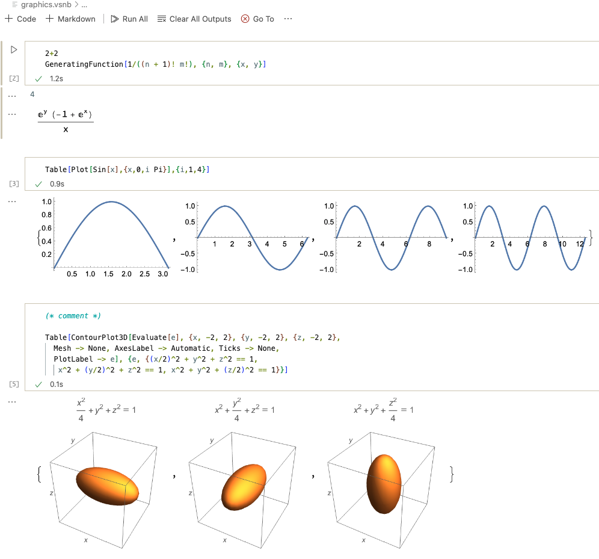
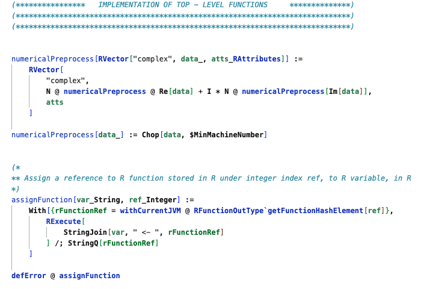
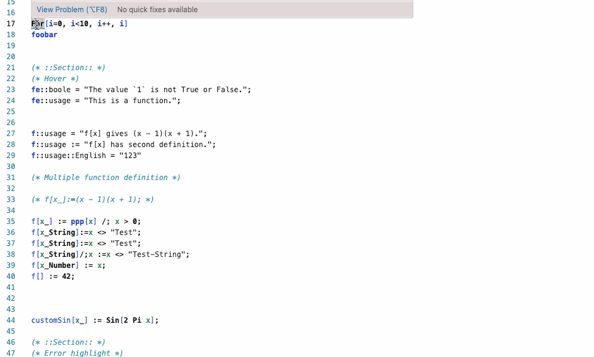
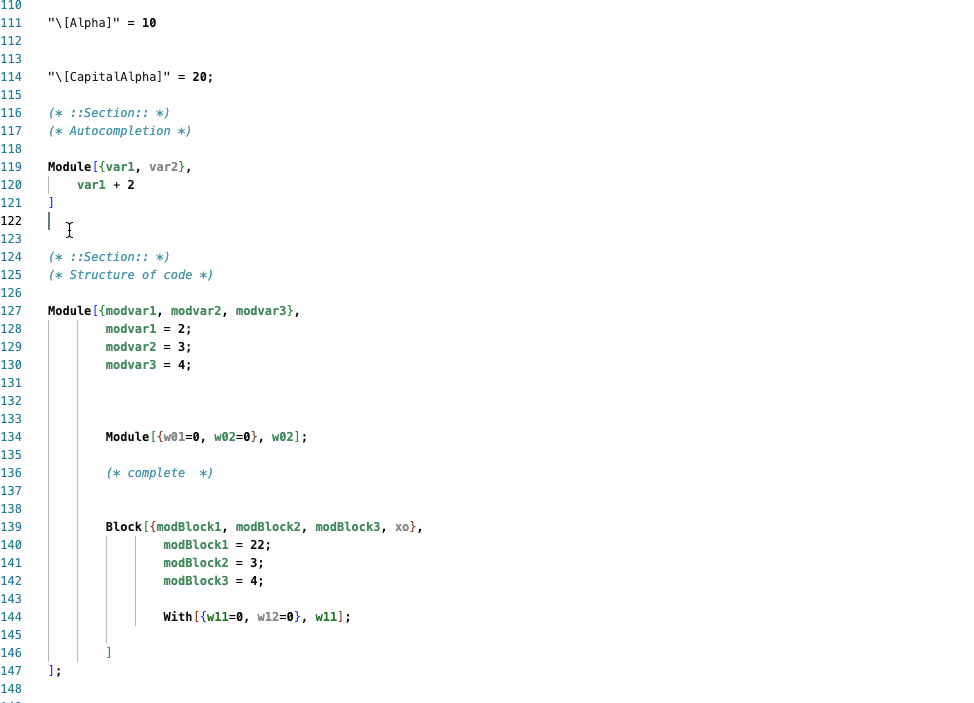

# Wolfram Language extension for Visual Studio Code

This extension provides support for the [Wolfram Language](https://www.wolfram.com/language) in Visual Studio Code. 

## Introduction

The [Wolfram Language](https://www.wolfram.com/language) is a symbolic language, designed with the breadth and unity needed to develop powerful programs quickly. The philosophy of Wolfram Language is to build as much knowledge—about algorithms and the world—into the language as possible. Wolfram Language represents everything—data, formulas, code, graphics, documents, interfaces, etc.—as symbolic expressions, making possible a new level of programming flexibility and power. 

The primary way to work in the Wolfram Language is through [Wolfram Notebooks](https://www.wolfram.com/notebooks/), which provide a rich environment for creating and sharing documents that combine code, text, graphics, and interactive interfaces. These notebooks can be created and edited in the [Wolfram Desktop](https://www.wolfram.com/wolfram-one/) and the [Wolfram Cloud](https://www.wolfram.com/cloud/).

For developers who prefer to work in a text editor, this extension provides support for the Wolfram Language in Visual Studio Code. This extension provides syntax highlighting, diagnostics, formatting, and other features to help you write Wolfram Language code in Visual Studio Code. It also provides support for running Wolfram Language code in a terminal and for creating more basic Visual Studio Code style notebooks.

# Installing and configuring the extension

To install this extension, click on the install button at the top of this page. In most cases, the extension will automatically find the Wolfram Language kernel if the kernel is installed in the default location. 

If the kernel is not found, you can specify the path to the kernel in the extension settings. You can open the extension settings by clicking the gear icon at the top of this page and selecting `Extension Settings` from the dropdown menu. In the Settings window that opens, search for `Wolfram: System Kernel` and enter the path to the Wolfram Language kernel executable.

For more information on configuring the extension, see the [Configuration Details](Docs/configuration-details.md) page.

## Extension features overview

### Notebook features

This extension provides support for creating the more basic Visual Studio style notebooks that can run Wolfram Language inputs. These notebooks are created with the `.vsnb` extension. These notebooks support basic output like text, static graphics, warnings, and messages.

For full [Wolfram Language notebook](https://wwww.wolfram.com/notebooks) support, use the [Wolfram Desktop](https://www.wolfram.com/one) or [Wolfram Cloud](https://www.wolfram.com/cloud).

### Syntax Highlighting

Syntax highlighting makes your Wolfram Language code easier to read and understand:

### Themes

This extension provides several themes, including syntax highlighting for the Wolfram Language. The themes provided are:

* Wolfram (Default) -- Provides a light theme with default Wolfram notebook syntax colors. 
* Wolfram (Light) -- Provides a light theme with muted colors
* Wolfram (Dark) -- Provides a dark theme.
* Wolfram (Dark Rainbow) -- Provdes a more colorful dark theme.

### Hover support

When you hover over a Wolfram system function, you can see a brief description of the function:

### Completion support

When you start typing a Wolfram system function, you can see a list of possible completions:

