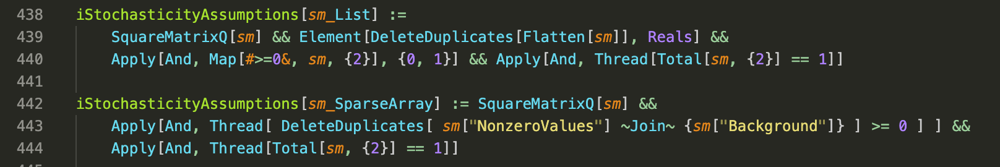
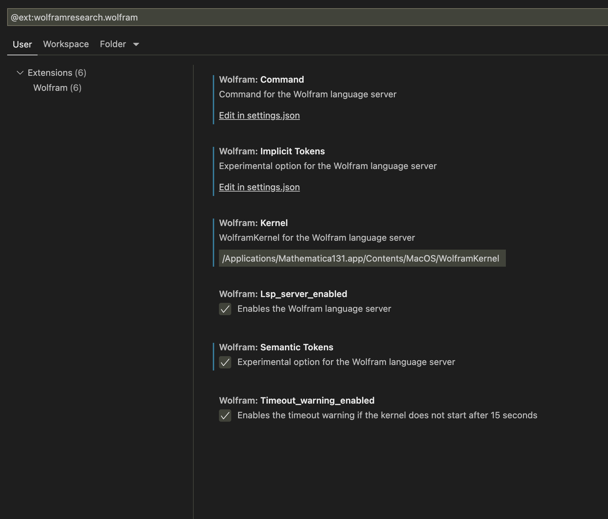

# Wolfram System Integration with Visual Studio Code

Official Visual Studio Code extension for Wolfram Language

[Developing Wolfram Language Code in Other Editors and IDEs with LSP from WTC 2021: Watch Video (youtube)](https://www.youtube.com/watch?v=nXVEOUMZbzQ)

Download and install the free [Wolfram Engine](https://www.wolfram.com/engine/)


## Features

* Syntax Highlighting
* Diagnostics and suggestions for fixes
* Formatting files and selections
* Semantic highlighting
* Expand and shrink selection
* Outline
* Color swatches
* Symbol references
* Documentation on hover
* New menu items (Open in System Editor)

### Syntax Highlighting

Support for the entire Wolfram Language syntax and all built-in functions.




## Setup

<!--  filter me START -->
Install the Wolfram Language extension from the [Visual Studio Code Marketplace](https://marketplace.visualstudio.com/items?itemName=WolframResearch.wolfram).

The extension must be installed from Wolfram Research.
<!--  filter me END -->

LSP functionality uses a Wolfram kernel to run as a language server.

This requires Wolfram System 12.1 or higher.

You can use either Mathematica or the free Wolfram Engine.

If you do not have the Wolfram System installed, then download and install the free [Wolfram Engine](https://www.wolfram.com/engine/).

The Wolfram Language extension depends on [LSPServer paclet](https://github.com/WolframResearch/lspserver) to provide LSP functionality.

Install LSPServer paclet and its dependencies by running this Wolfram Language code:
```
PacletInstall["CodeParser"]
PacletInstall["CodeInspector"]
PacletInstall["CodeFormatter"]
PacletInstall["LSPServer"]
```

If properly setup, you should have syntax highlighting and linting of Wolfram Language `.wl` files.

Test this by typing this into a new `.wl` file and saving it:
```
Which[a, b, a, b]
```

You should see warnings about duplicate clauses.


### Settings

If you have Wolfram System (either Mathematica or Wolfram Engine) installed in the default location on your system, you may not have to change any settings.

If Wolfram System is not in the default location, then specify the actual location:

Open the Command Palette

Enter the command:
`Preferences: Configure Language Specific Settings...`

Enter `@ext:wolframresearch.wolfram `

A UI file is now open.



And change the `Wolfram: Kernel` setting to the location of the `WolframKernel` executable to use.

The default location for Wolfram Engine on Linux is:
```
/usr/local/Wolfram/WolframEngine/13.1/Executables/WolframKernel
```

The default location for Wolfram Engine on Windows is:
```
C:\Program Files\Wolfram Research\Wolfram Engine\13.1\WolframKernel.exe
```

The default location for Wolfram Engine on macOS is:
```
/Applications/Mathematica.app/Contents/MacOS/WolframKernel
```


#### Other Settings

It is convenient to remove `$` from word separators, which is a letterlike character in WL.

It is also convenient to add `_` from word separators, which is NOT a letterlike character in WL.
```
"editor.wordSeparators": "`~!@#%^&*()-=+[{]}\\|;:'\",.<>/?_"
```

A color theme that focuses on WL syntax is available.
```
"workbench.colorTheme": "BrentonWL"
```


#### Experimental Settings

You can enable experimental settings. These are not supported.

`Wolfram: Implicit Tokens` controls the display of implicit tokens:
```
["*", ",", ";;", "?"]
```

* `"*"`: display implicit Times character `×`
* `","`: display `Null` around stray commas
* `;;`: display `1` and `All` around `;;`
* `;`: display `Null` after `;`
* `?`: display `□` in place of missing arguments


`Wolfram: Semantic Tokens` controls semantic highlighting such as `Module` variables.

To use semantic tokens, a theme that has semantic highlighting enabled must be used, such as `BrentonWL`.


## Troubleshooting

Make sure that the paclets can be found on your system:
```
PacletInstall["CodeParser"]
PacletInstall["CodeInspector"]
PacletInstall["CodeFormatter"]
PacletInstall["LSPServer"]

Needs["LSPServer`"]
```

If the kernel cannot start, then check Output view and open the Wolfram Language Error Report output channel for more information.


